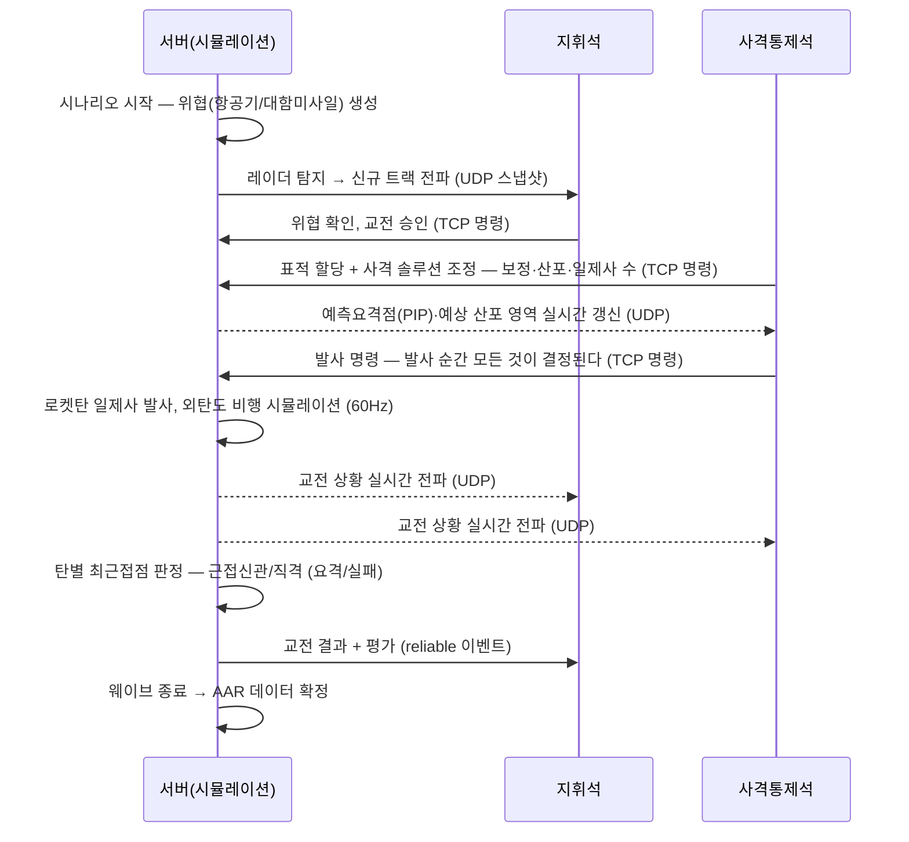
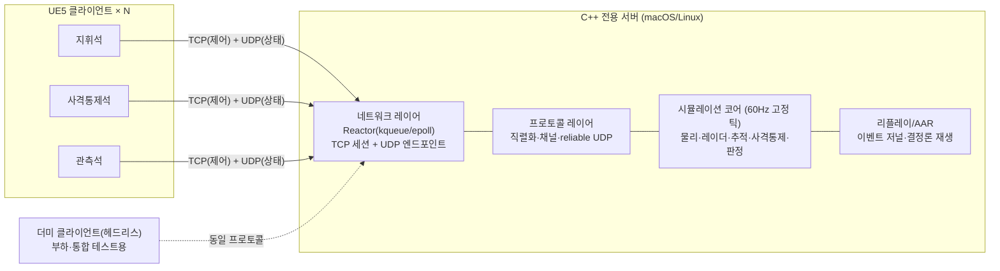

# Project SeaShield — 함대공 교전 시뮬레이터 기획서

> **Naval Air-Defense Engagement Simulator**
> C++ / UDP·TCP 멀티클라이언트 게임서버 기반 정밀 3D 교전 시뮬레이터
>
> 문서 버전: v2.1 (2026-06-11) · 상태: 기획 확정
> v2.0: 요격 수단을 함대공 유도탄(PN)에서 **무유도 로켓탄 일제사 사격통제**로 개정 (§2.4 프레이밍 신설). 유도탄은 확장 백로그로 이동.
> v2.1: 장기 비전 — **스팀(Steam) 시뮬레이터 게임 출시** 신설(§13) + 게임화 로드맵 P7~P9 추가(§9). P5 클라이언트 비주얼 목표 상향(§9·§11).
> 프로젝트명은 가칭이며 후보: **SeaShield**(기본), Aegir(북유럽 바다의 신), Watchkeeper

---

## 1. 프로젝트 개요

### 1.1 한 줄 정의

**함정 전투정보실(CIC, Combat Information Center)의 관점에서 공중 위협의 탐지 → 추적 → 위협평가 → 교전 → 요격평가 전 과정(킬체인)을 재현하는, 서버 권위(server-authoritative) 기반 멀티클라이언트 3D 교전 시뮬레이터.**

요격 수단은 유도무기가 아닌 **무유도 로켓탄(unguided rocket)의 일제사(salvo)** 다. 발사 후 궤도 수정이 불가능하므로, **발사 순간의 사격통제 계산** — 표적 미래 위치 예측, 외탄도(중력·항력·바람), 환경 보정 — 이 명중의 전부를 결정한다. 본 시뮬레이터는 실존 체계의 모사가 아니라 **"무유도 요격의 한계를 정량 탐구하는 실험적 체계"** 로 스스로를 정의하며(§2.4), 이 정직한 프레이밍이 도메인 면접에서의 방어선이자 어필 포인트다.

### 1.2 포지셔닝 — 게임과 시뮬레이터의 하이브리드

| 측면 | 시뮬레이터 성격 (충실도) | 게임 성격 (재미/평가) |
|---|---|---|
| 물리/사격통제 | 외탄도(중력·항력·바람), 칼만 필터 추적·예측, 예측요격점(PIP) 수치계산, 레이더 탐지 모델 | 사격 솔루션 조정(보정·산포·일제사 수)과 발사 시점 판단이 곧 플레이어 스킬 |
| 시간 | 고정 타임스텝 결정론적 시뮬레이션 | 실시간 진행, 긴장감 있는 교전 템포 |
| 운용 | 실제 CIC 운용석 분담(지휘/사격통제/관측) 모사 | 협동 플레이 구조 |
| 평가 | 사후분석(AAR, After-Action Review), 리플레이 | 점수: 요격률, 반응시간, 탄 소모 효율 |
| 시나리오 | 위협 축선·기동 패턴 기반 시나리오 정의 | 웨이브 방식 난이도 상승 |

### 1.3 포트폴리오 목표 — 요구사항 충족 선언

본 프로젝트는 방산업체 C++ 개발 직무 포트폴리오이며, 사전에 전달받은 핵심 요구사항을 다음과 같이 충족한다.

| 전달받은 요구사항 | 본 프로젝트의 반영 |
|---|---|
| "C++, UDP/TCP 기반 게임서버" | 서버 전체를 **C++20**으로 직접 구현. TCP(제어 채널)와 UDP(실시간 상태 채널)를 **역할 분리하여 동시 운용** (§4.3) |
| "온라인 서비스일 필요는 없음. 여러 클라이언트를 받아서 처리하는 서버" | 인터넷 서비스가 아닌 **LAN 환경의 다중 운용석(클라이언트) 동시 접속** 구조. 멀티클라이언트의 도메인적 정당화는 §3.1 |
| (묵시) 방산 도메인 적합성 | 함정 대공방어 킬체인, 추적·사격통제(탄도/예측) 알고리즘, 결정론·재현성·검증 문화 등 방산 소프트웨어가 중시하는 가치를 설계 전반에 반영 |

**포트폴리오 완료 기준(DoD)**: ① 하드 요구사항의 라이브 시연 — 실 클라이언트 3대(운용석 3종) + 더미 클라이언트 동시 접속 교전 데모, ② 핵심 어필 포인트별 증빙(코드·설계 문서·실측치) 충족, ③ 모든 설계 결정에 실측치·문서 근거로 답변 가능한 상태.

### 1.4 핵심 어필 포인트 요약

1. 크로스플랫폼 비동기 I/O 추상화 — kqueue/epoll Reactor 직접 구현
2. TCP/UDP 하이브리드 프로토콜 + 커스텀 reliable UDP 레이어
3. 서버 권위 · 고정 틱 · 결정론적 시뮬레이션 + 리플레이/AAR
4. 시뮬레이션-I/O 스레드 분리와 lock-free 큐 기반 멀티스레딩 설계
5. 도메인 알고리즘: 칼만 필터 표적 추적·예측, 외탄도 + 예측요격점(PIP) 사격통제
6. 검증 문화: 결정론 회귀 테스트, 네트워크 불량환경 테스트, CI 매트릭스
7. 측정 기반 성능 엔지니어링 (틱 지터, 처리량, 프로파일링 보고서)
8. 요구사항→설계→테스트 추적성 (방산 V-model 친화)
9. "멀티클라이언트 = CIC 운용석"이라는 요구사항의 도메인적 재해석

---

## 2. 도메인 배경 — 함정 대공방어

> 본 문서의 모든 도메인 정보는 **공개 자료(위키피디아, 방위사업청 보도자료, 학술 문헌) 수준**으로만 작성한다. 실제 무기체계의 제원·교리는 다루지 않으며, 시뮬레이션 파라미터는 전부 임의의 교육용 값이다.

### 2.1 대공방어 킬체인(Kill Chain)

함정의 대공전(AAW, Anti-Air Warfare)은 일반적으로 다음 단계로 구성된다.

```
탐지(Detect) → 추적(Track) → 위협평가(Threat Evaluation)
   → 무장할당(Weapon Assignment) → 교전(Engage) → 요격평가(Kill Assessment)
```

| 킬체인 단계 | 실제 체계 | 본 시뮬레이터의 구현 |
|---|---|---|
| 탐지 | 3차원 대공 레이더 | 회전 스캔 레이더 모델: 탐지확률, 측정 노이즈 (§5.4) |
| 추적 | 추적 레이더 / 전투체계 트랙 관리 | 칼만 필터 기반 트랙 생성·유지·소실 (§5.5) |
| 위협평가 | 전투체계 자동평가 + 승조원 판단 | CPA·도달시간 기반 위협 우선순위 + **지휘석 운용자 판단** |
| 무장할당 | 무장통제체계 | **사격통제석 운용자**의 표적-무장 할당 |
| 교전 | 함포/CIWS 사격, 함대공 유도탄 | **무유도 로켓탄 일제사** — 사격통제(PIP) 계산 + 외탄도 시뮬레이션 (§5.6) |
| 요격평가 | 레이더 관측 기반 판정 | 최근접거리(miss distance) 기반 교전 판정 (§5.7) |

### 2.2 참조 체계 (공개 자료 기준)

- **이지스(AEGIS) 전투체계** — 탐지·추적·교전을 통합한 함정 전투체계의 대표 사례. "다수 콘솔이 하나의 전술상황도를 공유"하는 구조가 본 프로젝트의 멀티클라이언트 모델의 원형.
- **CIWS(근접방어무기체계 — 골키퍼/팰렁스)** — 무유도 발사체(고속 기관포탄)의 탄막으로 날아오는 대함미사일을 요격하는 실존 체계. "무유도 + 사격통제 계산 + 다수탄"이라는 본 시뮬레이터 교전 모델의 현실 측 준거점. 함대공 유도탄(해궁 등)은 확장 백로그(§9)의 참조 체계.
- **시스키밍(sea-skimming) 대함미사일** — 초저고도 침투로 탐지 시간을 단축시키는 대표 위협. 본 시뮬레이터의 주 위협 모델.

### 2.3 왜 이 도메인인가

- 방산 소프트웨어의 핵심 가치(**실시간성, 신뢰성, 결정론, 재현성, 검증 가능성**)를 게임서버 기술로 자연스럽게 증명할 수 있는 교차점이다.
- 추적·탄도·사격통제 알고리즘은 학부 수준 수학(선형대수, 미분방정식, 확률)으로 구현·검증 가능하면서도 깊은 기술 대화 소재가 된다.
- "게임서버 경험을 방산 시뮬레이터에 어떻게 전이할 것인가"라는 면접 단골 질문에 대한 실증 답변이 된다.

### 2.4 ★ 왜 무유도인가 — "실험적 체계" 프레이밍

현실의 해군에 무유도 로켓탄만으로 대공 요격을 수행하는 체계는 없다. 무유도탄은 발사 후 보정이 불가능해 표적의 발사 후 기동에 대응할 수 없고, 실무기는 이 한계를 **탄막**(CIWS — 분당 수천 발의 기관포탄으로 산포를 덮음)이나 **유도**(함대공 유도탄)로 극복한다. 본 시뮬레이터는 이 사실을 숨기지 않고 출발점으로 삼는다:

> **본 시뮬레이터는 실존 무기체계의 모사가 아니라, "무유도 일제사 요격의 성능 한계는 어디까지인가"를 정량 측정하는 실험 플랫폼이다.**

- 교전거리·표적 기동성·일제사 규모·환경 조건(바람/날씨)별 요격률을 AAR 데이터로 축적 → **"왜 현대 대공무기는 유도탄인가"를 자기 시뮬레이터의 데이터로 답한다.** 면접에서 "그런 체계가 실존하나요?"라는 질문이 공격이 아니라 준비된 어필이 되는 구조.
- 게임 관점: 발사 순간에 모든 것이 결정되는 **고긴장 사격**이 핵심 재미다 — 유도탄처럼 쏘고 나서 지켜보는 것이 아니라, **쏘기 전에 계산하고 보정하는 것**이 플레이.
- 함대공 유도탄(PN)은 이 실험의 자연스러운 2부로 확장 백로그에 배치(§9) — "무유도의 한계를 측정했으니, 유도가 그 한계를 어떻게 푸는지 보인다"는 연구 서사.

---

## 3. 핵심 컨셉

### 3.1 ★ 멀티클라이언트 = CIC 운용석 — 요구사항의 도메인적 재해석

"온라인 게임이 아닌데 왜 멀티클라이언트 서버인가?"에 대한 본 프로젝트의 답:

> 실제 함정의 전투정보실(CIC)은 **하나의 전술 상황(단일 진실 공급원)을 여러 운용 콘솔이 동시에 공유**하며, 각 콘솔은 역할에 따라 다른 화면과 권한을 가진다. 이는 구조적으로 "권위 서버 1 + 역할 기반 클라이언트 N"의 게임서버 아키텍처와 정확히 동형(isomorphic)이다.

즉 멀티클라이언트 서버는 온라인 서비스를 위한 것이 아니라 **도메인 그 자체의 요구**다. 이 재해석은 단순한 기술 데모를 도메인 시스템으로 격상시키는 본 기획의 중심 아이디어다.

```
                ┌─────────────────────────────┐
                │   C++ 교전 시뮬레이션 서버      │
                │  (단일 진실 공급원 / 권위 모델)  │
                └──────┬──────┬──────┬────────┘
                  TCP+UDP  TCP+UDP  TCP+UDP
                       │      │      │
                ┌──────┴┐ ┌───┴───┐ ┌┴────────┐
                │ 지휘석 │ │사격통제석│ │ 관측석   │   ← UE5 클라이언트 N대
                │ (CO)  │ │ (WCO)  │ │(Observer)│      (역할별 화면·권한 상이)
                └───────┘ └────────┘ └─────────┘
```

### 3.2 운용석(클라이언트 역할) 정의

| 운용석 | 권한 | 주 화면 | 핵심 행위 |
|---|---|---|---|
| **지휘석 (Commander)** | 교전 승인/중지, 교전규칙(ROE) 설정 | 전술상황도(PPI) + 위협 목록 | 위협 우선순위 확인, 교전 승인 |
| **사격통제석 (Weapons)** | 표적-무장 할당, 사격 솔루션 조정, 발사 | 사격통제 화면(PIP·예상 산포 표시) + 3D 교전 뷰 | 표적 지정, 보정 파라미터(리드 오프셋·산포 패턴·일제사 수) 조정, 발사 시점 결정 |
| **관측석 (Observer)** | 읽기 전용 | 자유 시점 3D 뷰 / 리플레이 | 훈련 평가자·참관 시점 (시연·발표에도 활용) |

- 최소 구성: 클라이언트 1대(전 역할 겸임 모드)로도 플레이 가능 → 시연 부담 완화.
- 다중 구성: 2~3대 분담 시 협동 시뮬레이션. **N대 동시 접속 처리 자체가 요구사항 시연.**

### 3.3 교전 루프 (핵심 플레이 시나리오)



게임 루프 관점: **웨이브 단위 시나리오** (위협 수·축선·기동 난이도 상승) → 웨이브 종료 시 점수(요격률·평균 반응시간·탄 효율) → 전체 시나리오 종료 후 AAR/리플레이.

---

## 4. 시스템 아키텍처

### 4.1 전체 구성



**설계 원칙**

1. **서버 권위(server-authoritative)**: 모든 물리·탐지·판정은 서버에서만 수행. 클라이언트는 표현(presentation)과 입력만 담당. → 치팅 방지 목적이 아니라 **"시뮬레이션 결과의 단일성·재현성"** 이라는 시뮬레이터 요구에서 도출.
2. **시뮬레이션 코어의 네트워크 무의존**: `sim` 모듈은 소켓을 모른다. 헤드리스 실행·단위 테스트·리플레이가 가능해지는 구조적 토대.
3. **프로토콜 코어의 공유**: 직렬화·패킷 정의는 독립 라이브러리로 분리해 서버·UE5 클라이언트·더미 클라이언트가 동일 코드를 사용 (이중 구현 제거).

### 4.2 모듈 분해

```
seashield/
├── core/        # 공통: 수학(벡터/쿼터니언), 시간, 로깅, 설정
├── net/         # Reactor 추상화, TCP/UDP 소켓, 세션 관리
├── protocol/    # 패킷 정의, 바이너리 직렬화, reliable UDP 채널
├── sim/         # 월드, 엔티티, 물리, 레이더, 칼만 추적, 사격통제(PIP)·외탄도, 교전 판정
├── replay/      # 이벤트 저널 기록·재생, 상태 해시
├── server/      # 메인 서버 실행 파일 (net+protocol+sim 조립)
├── tools/       # 더미 클라이언트, 부하 테스트 드라이버, 리플레이 뷰어(CLI)
└── tests/       # 단위·통합·결정론 회귀 테스트
```

### 4.3 TCP / UDP 역할 분리

| 항목 | TCP 채널 | UDP 채널 |
|---|---|---|
| 용도 | 세션 수립, 인증(간이), 운용석 역할 할당, 시나리오 로드/시작/중지, 교전 승인·사격 솔루션 조정·발사 명령, AAR 데이터 | 엔티티 상태 스냅샷(위치·자세·속도), 트랙 정보, PIP/예상 산포 갱신, 교전 이벤트 |
| 빈도 | 저빈도 (이벤트성) | 고빈도 (서버 틱 60Hz → 송신 30Hz) |
| 신뢰성 요구 | 무조건 도달·순서 보장 필요 | 최신 상태가 중요, 손실 허용 (스냅샷) + 중요 이벤트만 reliable UDP |
| 선택 근거 | 명령 유실은 시뮬레이션 무결성 훼손 → OS가 보장하는 신뢰성 사용 | TCP는 head-of-line blocking으로 실시간 상태 전파에 부적합. 오래된 상태의 재전송은 무가치 |

**왜 명령을 UDP reliable 채널로 통일하지 않는가**: 가능하지만, "각 데이터의 특성에 맞는 전송 계층 선택"이라는 설계 판단 자체를 보여주는 것이 목적이며, TCP/UDP 동시 운용이 요구사항이기도 하다. 단, 교전 결과 같은 **시뮬레이션 타이밍에 결합된 중요 이벤트**는 UDP reliable 채널로 전송해 두 방식을 모두 시연한다.

### 4.4 커스텀 Reliable UDP 레이어 (설계 요점)

TCP를 재구현하는 것이 아니라 **선택적 신뢰성(selective reliability)** 만 제공한다.

- 패킷 헤더: `sequence(16bit)`, `ack(16bit)`, `ack_bitfield(32bit)` — 최근 33개 패킷의 수신 여부를 piggyback으로 상호 통지.
- 채널 구분: `Unreliable`(스냅샷 — 재전송 없음), `Reliable-Unordered`(교전 이벤트 — 미확인 시 재전송), `Reliable-Ordered`는 의도적으로 미지원(필요한 데이터는 TCP로).
- 재전송: RTT 추정(지수이동평균) 기반 타임아웃, 신규 패킷에 미확인 메시지 동봉(piggyback retransmission).
- 시퀀스 비교는 wrap-around 안전 연산(`int16_t` 차이 비교)으로 처리.

### 4.5 네트워크 I/O 추상화 — Reactor 패턴

개발·시연 환경이 macOS이므로 **kqueue를 1차 타깃**, CI·서버 환경 호환을 위해 **epoll(Linux)을 2차 타깃**으로 동시 지원한다.

```
EventLoop (인터페이스)
 ├── KqueueEventLoop   (macOS — kevent 기반)
 └── EpollEventLoop    (Linux — epoll_wait 기반)
       ↑ 등록: fd + 관심 이벤트(READ/WRITE) + 콜백
```

- 공통 모델: **readiness 기반 Reactor** — "읽을 수 있게 되면 알려달라" → non-blocking read/write.
- **IOCP(Windows) 확장 전략**: IOCP는 completion 기반 Proactor라서 추상화 경계가 다르다. 본 설계는 콜백 단위를 "이벤트 발생"이 아닌 **"수신된 버퍼 전달"** 수준으로 한 단계 올려, 추후 IOCP 구현체가 같은 인터페이스를 만족할 수 있도록 여지를 남긴다(설계 문서에 명시, 구현은 범위 외).
- 라이브러리(asio 등)를 쓰지 않는 이유: **OS 레벨 I/O 멀티플렉싱을 직접 다뤄본 경험**이 본 포트폴리오의 핵심 어필이기 때문. 단, 설계 문서에서 asio와의 구조 비교를 다뤄 "알고도 직접 만든 것"임을 보인다.

### 4.6 스레딩 모델

```
[Network I/O Thread]                    [Simulation Thread (60Hz 고정 틱)]
  Reactor 루프                             ┌─ 틱 시작
  ├ TCP/UDP 수신 → 패킷 파싱                │ 1. 수신 큐 드레인 → 명령/입력 적용
  ├ 수신 큐(SPSC lock-free)에 push  ───────▶│ 2. 시뮬레이션 스텝 (물리→레이더→추적→사격통제→판정)
  └ 송신 큐에서 pop → 소켓 송신   ◀───────  │ 3. 스냅샷 생성 → 송신 큐(SPSC) push
                                           └─ 다음 틱까지 sleep (지터 측정)
```

- **2-스레드 기본형**(I/O 1 + Sim 1)으로 시작. 목표 규모(클라이언트 ≤ 8, 엔티티 ≤ 500)에서는 이것으로 충분하며, **"규모에 맞는 가장 단순한 설계"** 라는 판단 근거 자체를 문서화한다.
- 스레드 간 통신은 **lock-free SPSC 큐 한 쌍(수신/송신)** 으로 한정 — I/O 1 : Sim 1 구조이므로 SPSC로 충분. 공유 가변 상태를 큐 경계로 격리해 레이스 가능 지점을 큐 구현 내부로 한정하고, 큐 자체는 단위 테스트 + TSan으로 검증한다("레이스가 없다"가 아니라 "레이스 가능 지점이 검증 가능한 한 곳뿐"이라는 논증 구조).
- 확장 경로(문서화): 엔티티 수 증가 시 시뮬레이션 내부 병렬화(시스템 단위 task 분할), I/O 스레드 증설(UDP는 SO_REUSEPORT — 이때 수신 큐는 Vyukov 시퀀스 카운터 방식 MPSC로 전환).

### 4.7 시간 모델

- 서버: `tick = 1/60s` 고정. 시뮬레이션 시간은 틱 카운터로만 진행(벽시계와 분리).
- 클라이언트: 서버 스냅샷에 틱 번호 포함 → **보간 버퍼(100ms = 30Hz 스냅샷 3개분, 1개 손실 허용)** 를 두고 두 스냅샷 사이를 보간 렌더링. 클라이언트는 "수신 틱 ↔ 로컬 시계" 오프셋을 지수이동평균으로 추정해 서버 틱을 로컬 렌더 시간에 매핑하고, 장시간 교전 중 시계 드리프트를 같은 추정기로 흡수한다. 예측(prediction)은 의도적으로 미적용 — 운용석은 직접 조종이 아닌 명령 기반이라 입력 지연 허용치가 크다는 도메인 근거를 문서화.

### 4.8 멀티클라이언트 서버 메커니즘 — 하드 요구사항의 충족 명세

> "여러 클라이언트를 받아서 처리하는 서버"라는 요구사항을 선언이 아닌 **엔지니어링 명세**로 만드는 절. 게임서버 기술면접의 1차 공격 지점이므로 설계 수준에서 미리 답을 고정한다.

- **TCP 메시지 프레이밍**: TCP는 바이트 스트림이므로 메시지 경계가 없다 → `[길이 프리픽스(2B)][페이로드]` 프레이밍 + 세션별 수신 버퍼에 부분 수신(partial read)을 누적하는 상태 보존 파서. 송신도 partial write를 고려해 세션별 송신 버퍼에서 이어쓴다.
- **느린 클라이언트 격리 (backpressure)**: 클라이언트별 송신 큐에 상한(예: 256KB 또는 2초분)을 두고, `EWOULDBLOCK` 시 큐에 적재 → 상한 초과 시 해당 클라이언트만 강제 절단. **한 클라이언트의 지연이 서버 틱이나 다른 클라이언트에 전파되지 않는다**는 격리 원칙이 핵심이며, 부하 테스트에서 의도적 저속 클라이언트를 붙여 검증한다.
- **연결 수명주기 상태머신**: `CONNECTING → HANDSHAKE(버전·역할 협상) → ACTIVE → DISCONNECTED`. **교전 중 끊김 정책**: 시뮬레이션은 계속 진행(서버 권위 — 세계는 운용자를 기다리지 않는다), 해당 운용석 권한은 잠금, 세션 토큰으로 재접속 시 역할 복귀 + 전체 스냅샷 재동기화.
- **공정성**: 단일 I/O 스레드는 ready 소켓을 라운드로빈 처리하고, 클라이언트당 틱별 명령 처리 개수에 상한을 두어 수신 폭주 클라이언트가 이벤트 루프를 독점하지 못하게 한다.

---

## 5. 시뮬레이션 설계 (충실도 명세)

### 5.1 기본 원칙 — 결정론(Determinism)

동일 시나리오 + 동일 입력 저널 → **비트 수준 동일한 결과**를 보장한다(동일 바이너리·플랫폼 전제).

| 결정론 조건 | 구현 방침 |
|---|---|
| 고정 타임스텝 | 60Hz 고정, 가변 dt 금지 |
| 갱신 순서 고정 | 엔티티 ID 순 정렬 갱신, 컨테이너 순회 순서 보장 |
| 난수 | 시드 고정 PRNG(PCG32), 시드는 시나리오 파일에 기록 |
| 입력 | 모든 외부 입력(명령)을 틱 번호와 함께 저널에 기록 |
| 부동소수점 | 동일 바이너리·동일 플랫폼 전제 + FMA contraction 통제(`-ffp-contract=off`). 결정론 경로의 초월함수(sin/cos 등)는 libm 버전 차를 피하기 위해 고정 구현 사용. 크로스 플랫폼 비트 동일성은 비목표로 명시(한계의 인지 자체가 어필) |

### 5.2 좌표계·단위

- 로컬 ENU(East-North-Up) 직교좌표계, 원점은 자함(own ship) 초기 위치. 시나리오 공간 약 40km × 40km × 10km — 지구 곡률 무시 가능 범위로 한정(판단 근거 문서화).
- SI 단위(m, m/s, rad). 시뮬레이션 내부 `double`, 네트워크 전송 시 `float`/양자화.

### 5.3 엔티티 모델

| 엔티티 | 운동 모델 | 비고 |
|---|---|---|
| 자함(함정) | 정지 또는 등속 직진 | 교전의 기준점. 조함은 비목표 |
| 위협: 항공기 | 3DOF 질점(point-mass) + 웨이포인트/선회 기동 | 아음속 ~250m/s급 (공격기/초계기 상정) |
| 위협: 대함미사일 | 3DOF 질점 + **시스키밍**(저고도 직진) / 종말 **팝업·위빙 기동** | 아음속 ~290m/s급 ASM, **주 위협** (초음속 ASM은 확장 백로그) |
| 요격탄(무유도 로켓탄) | 3DOF 질점 + 외탄도(중력·항력·바람) + 부스트–활공 추력 프로파일 + 발사 산포 | 일제사(salvo) 단위 발사. §5.6 |

3DOF(위치 3자유도, 질점) 선택 근거: 교전 기하·탄도·사격통제 검증에는 3DOF가 표준적 출발점이며, 자세 동역학(6DOF)은 본 프로젝트의 검증 범위를 넘는 파라미터 식별 부담만 더한다. 6DOF는 확장 로드맵에 명시.

### 5.4 레이더 모델

- **회전 스캔**: 주기 T_scan(예: 2초), 스캔 빔이 표적 방위를 지날 때만 탐지 기회 발생.
- **탐지 확률 Pd**: 거리 기반 단순 SNR 모델(SNR ∝ 1/R⁴)에 시그모이드를 씌운 Pd(R). 저고도 표적은 수평선 차폐(레이더 호라이즌) 적용 — 시스키밍 위협이 "늦게 보이는" 핵심 메커니즘.
- **측정 노이즈**: 구면좌표(거리 σ_r, 방위 σ_az, 고각 σ_el) 가우시안 노이즈 → 직교좌표 변환 후 추적 필터 입력.
- 측정은 **트랙이 아닌 플롯(plot)** 으로 생성 — 탐지와 추적의 분리가 §5.5의 존재 이유.

### 5.5 표적 추적 — 칼만 필터(Kalman Filter)

- 상태 벡터: `x = [p, v] ∈ R⁶` (위치·속도), **등속(CV) 모델** 기반 선형 칼만 필터.
- 프로세스 노이즈 Q로 기동 불확실성 흡수(백색 가속 노이즈 모델), 측정 노이즈 R은 레이더 모델 σ와 일치 — **모델과 필터의 정합성**을 검증 포인트로.
- **트랙 관리**: 게이팅(마할라노비스 거리) → 플롯-트랙 연관(최근접 이웃 NN) → M-of-N 규칙으로 트랙 개시 / 미연관 지속 시 트랙 소실.
- 확장 로드맵: 기동 표적 대응 IMM(다중 모델), JPDA 연관.
- 효과: 운용자 화면에는 진실(truth)이 아닌 **추정 트랙**이 표시된다 — "신의 시점이 아닌 센서의 시점"이 시뮬레이터 충실도의 핵심.

### 5.6 사격통제(Fire Control) — 예측요격점 계산과 외탄도

무유도탄의 명중은 발사 순간에 결정된다. 사격통제는 다음 인과 사슬로 구성된다:

1. **표적 미래 위치 예측**: 추적 필터(§5.5)의 상태 추정(위치·속도)을 탄 비행시간만큼 외삽. **진실이 아닌 추정 트랙**을 쓰므로 트랙 품질(Q/R 튜닝)이 곧 탄착 오차로 전파 — 센서→추적→사격의 시스템 수준 결합.
2. **외탄도(exterior ballistics)**: 중력 + 속도 제곱 항력(공기밀도 의존) + **바람**(고도별 풍속·풍향) + 부스트(추력)–활공 프로파일을 고정 스텝 수치적분(RK4, 결정론 유지). **환경(날씨) 변수가 탄착점을 직접 움직이는 1급 시민** — 시나리오의 풍속·강우(공기밀도/레이더 감쇠)가 난이도 축이 된다.
3. **예측요격점(PIP, Predicted Intercept Point) 수치해법**: "탄의 도달 시간"과 "표적의 도달 시간"이 일치하는 미래 지점을 반복 계산(고정점 반복)으로 푼다 — 닫힌 해가 없는 비선형 연립의 수치적 해. 수렴 조건·발산 케이스(추월 불가 기하)를 문서화.
4. **일제사(salvo)·산포(dispersion)**: 로켓탄은 발사각에 mil 단위 가우시안 산포(시드 고정 → 결정론 유지)를 가지므로 단발 명중률이 낮다 → N발을 PIP 주변에 패턴 사격. **발수·패턴 반경이 탄 소모 vs 요격률의 트레이드오프** — 게임플레이의 핵심 자원 관리.
5. **운용자 보정**: 자동 계산된 솔루션 위에 리드 오프셋·산포 패턴·발사 시점을 사격통제석 운용자가 조정 — "자동 솔루션을 신뢰할 것인가, 표적 기동을 읽고 보정할 것인가"의 판단이 플레이어 스킬.

**환경 모델 명세 (P2 구현 범위)**

| 요소 | 모델 |
|---|---|
| 대기 | 해면 온도·기압 + 고도 감률 → 밀도 ρ(h), 이상기체 기반 간이 ISA. 습도는 수증기압(Magnus 식)으로 밀도 미세 보정 |
| 바람 | 고도 레이어(0/0.5/1.5/3/6km)별 풍속·풍향 + 벡터 선형 보간. 고도에 따른 증속(멱법칙)·전향(veer) |
| 거스트/기류 | 평균 풍속·강우에 비례하는 난류 강도의 **OU(Ornstein-Uhlenbeck) 확률 과정** — 시드 고정으로 결정론 유지. **사격 솔루션은 평균 바람만 보상할 수 있고 거스트는 잔여 오차로 남는다 → 일제사가 필요한 물리적 이유** |
| 강우/습도 | 습도와 상관된 강우 생성. P2에선 항력 미세 영향 + 시나리오 상태 필드, P4에서 레이더 감쇠(탐지거리 감소)로 본격 활용 |
| 중력 | 시나리오 설정값 (기본 9.80665 m/s²) |
| **기상 생성기** | `weather_seed` 하나로 위 전부를 **현실적 범위·상관관계**(풍속↔난류 강도, 습도↔강우, 고도↔증속·전향)로 자동 샘플링 — "랜덤하지만 현실적인 환경". 시나리오 파일에서 개별 항목 명시 오버라이드 가능(테스트·실험용) |

- **검증**: 비행시간·탄착점을 해석해(항력 무시 포물선) 및 레퍼런스 수치적분(NumPy RK4)과 대조. 교전거리·표적 기동성·일제사 수·환경 조건별 요격률을 실험 보고서로 정량화 — §2.4의 연구 주제("무유도 요격의 한계") 그 자체.

### 5.7 교전 판정

- **탄별 판정**: 매 틱 각 로켓탄-표적 거리 추적, 부호 반전 시점에서 **최근접점(PCA) 보간 계산** → miss distance 산출. 일제사의 교전 결과는 탄별 판정의 집계.
- `miss < 근접신관 반경` → 요격확률 Pk 곡선으로 확률 판정(시드 고정 PRNG → 결정론 유지). 일제사 N발의 누적 요격률과 단발 Pk의 관계(독립 가정 1-(1-p)^N vs 산포 상관성으로 인한 실측 차이)가 실험 보고서의 분석 대상.
- 판정 결과는 reliable UDP 이벤트로 전 클라이언트 전파 + AAR 기록. 교전 이벤트에는 발생 틱 번호가 포함되어 수신측이 순서를 재구성하므로 Reliable-**Unordered** 채널로 충분(§4.4의 채널 설계 근거와 일관).

### 5.8 리플레이 / AAR

- **기록**: 시나리오 파일 + 시드 + 입력 저널(틱 번호, 명령)만 저장 — 결정론 덕분에 전체 상태 저장 불필요(저장 크기 수십 KB).
- **재생**: 서버를 리플레이 모드로 실행 → 동일 시뮬레이션 재현 → 관측석 클라이언트로 자유 시점 복기.
- **상태 해시**: N틱마다 월드 상태 해시를 기록 — 재생 시 해시 불일치 = 결정론 깨짐을 즉시 검출(회귀 테스트의 기반, §10.2).
- **AAR 리포트**: 교전별 타임라인(탐지→승인→발사→요격 시각), 반응시간, 요격률, 탄 효율 — 게임 점수이자 훈련 평가 지표.

---

## 6. 네트워크 프로토콜 개요

> 상세 명세는 Phase 3에서 별도 문서(`docs/architecture/protocol-spec.md`)로 작성. 여기서는 설계 방향만 정의한다.

- **직렬화**: 자체 바이너리 직렬화(리틀엔디언 고정, 명시적 패킹). protobuf/FlatBuffers 대비 트레이드오프(스키마 진화 vs 단순성·제로 의존성·학습 가치)를 문서화하고 의도적으로 자체 구현 선택.
- **패킷 구조(초안)**: `[프로토콜 매직+버전][채널][시퀀스/ACK 헤더(§4.4)][메시지 타입][페이로드]`.
- **스냅샷 동기화**: 서버 60Hz 시뮬레이션 → 30Hz 스냅샷 송신. 1차 구현은 전체 스냅샷(full snapshot), 2차로 **델타 압축**(클라이언트별 마지막 ACK 스냅샷 기준 차분) — 성능 보고서에서 대역폭 절감을 정량 비교.
- **양자화**: 위치(cm 정밀도 고정소수점), 자세(방위각 등 최소 표현) — 대역폭 측정과 함께 문서화.
- **전송 규모 산정 (공개 산수)**: 엔티티 1개 ≈ 20B (양자화 위치 9B + 속도 6B + ID/타입/상태 5B). 실전 시나리오(~100 엔티티) 풀 스냅샷 ≈ 2KB → 30Hz 기준 **~480kbps**, 델타 압축 적용 후 목표 **< 256kbps**. 엔티티 500은 부하 한계 측정용 스트레스 조건이며 그 경우 풀 스냅샷 ~2.4Mbps — LAN 대역폭 내이지만 256kbps 목표의 적용 대상이 아님을 명시.
- **관심 관리(interest management) 의도적 미적용**: CIC 도메인 특성상 **모든 운용석이 동일한 전술상황도를 공유**해야 하므로 공간 AOI 컬링이 부적합 — "안 한 것"이 아니라 "도메인 근거로 배제한 것"임을 문서화. 엔티티 폭증 대비책은 위협도 우선순위 기반 송신과 스냅샷 분할(확장 백로그).
- **단편화 정책**: UDP 페이로드 상한 ~1200B. 스냅샷이 상한을 넘으면 엔티티 배치(batch) 단위로 복수 데이터그램에 분할 — 각 데이터그램은 독립 디코딩 가능해 부분 손실을 허용한다(IP 단편화에 맡기지 않는 이유 포함).
- **보안 경계 (명시적 범위 설정)**: LAN 신뢰 환경 전제. UDP 스푸핑 표면(세션 토큰 추측·주입)이 존재함을 인지하되 암호화/HMAC은 범위 외로 선언 — 위협 표면을 알고 의도적으로 배제했음을 기록(방산 실무에서는 별도 보안 요구사항 절차로 다루는 영역).
- **세션 흐름**: TCP 접속 → 버전/역할 협상 → UDP 엔드포인트 바인딩(토큰으로 TCP 세션과 연결) → 시나리오 동기화 → 교전 루프.

---

## 7. UE5 클라이언트 개요

**원칙: 클라이언트는 표현 계층이다.** 게임플레이 판단 로직을 클라이언트에 두지 않으며, 개발 시간 배분도 서버:클라이언트 = 7:3을 유지한다.

- **구성 화면**: ① 3D 전장 뷰(함정·위협·로켓탄 일제사 궤적, 교전 카메라), ② 레이더 PPI 스코프(트랙 심볼, 위협 목록 — 군 표준 심볼로지 NTDS 스타일 참조), ③ 사격통제 패널(표적 지정·사격 솔루션 조정·PIP/예상 산포 표시·발사).
- **통신**: `protocol` 라이브러리를 UE5 서드파티 모듈로 링크 — 서버와 동일한 직렬화 코드 사용. 수신 스냅샷 → 보간 버퍼 → 액터 트랜스폼 반영.
- **역할별 화면 분기**: 접속 시 부여된 운용석 역할에 따라 UI 구성과 명령 권한이 달라짐(§3.2).
- macOS에서 UE5 에디터·패키징 모두 가능(Apple Silicon 네이티브 지원).

---

## 8. 기술 스택

| 분류 | 선택 | 비고 |
|---|---|---|
| 언어 | **C++20** (서버·프로토콜·시뮬레이션), UE5 C++ (클라이언트) | concepts, `std::span`, designated initializer 등 활용 |
| 빌드 | CMake ≥ 3.26 + Ninja | 서버 측. UE5는 UBT |
| 테스트 | GoogleTest / GoogleMock | 단위·통합·결정론 회귀 |
| CI | GitHub Actions — **macOS(arm64) + Linux(x86_64) 매트릭스** | 빌드·테스트·sanitizer 잡 |
| 정적분석/동적검사 | clang-tidy, ASan/UBSan/TSan | TSan으로 스레드 설계 검증 |
| 문서 | Markdown + mermaid, Doxygen(공개 API) | 본 문서 체계 |
| 외부 의존성 | **서버 코어는 표준 라이브러리만** (테스트 제외) | 제로 의존성 자체가 어필 포인트 |

---

## 9. 개발 로드맵

기간 무제한·품질 우선이므로 **각 Phase는 "시연 가능한 데모 + 산출 문서 + 검증 통과"로만 종료**된다(Definition of Done). 순서는 의존성 순.

| Phase | 내용 | 종료 기준 (데모/산출물) |
|---|---|---|
| **P0** 기획 | 본 기획서 | ✅ 본 문서 |
| **P1** 네트워크 코어 ✅ | Reactor(kqueue/epoll) 추상화, TCP 다중 접속(프레이밍·수명주기·backpressure §4.8), UDP 송수신, 세션 관리 | ✅ 데모: **클라이언트 8개 동시 접속** 에코/브로드캐스트 + 느린 클라이언트 격리 시연 (하드 요구사항의 1차 증명). 산출: 네트워크 설계서. 검증: 단위 테스트, TSan 클린 |
| **P2** 시뮬레이션 코어 (헤드리스) ✅ | 고정 틱 루프, 외탄도+환경(기상 생성기), 표적/교전 판정, 진실 기반 PIP 솔버, 시나리오 로더, 입력 저널, 상태 해시 | ✅ 데모: 탄도 샌드박스 CLI(자동/수동 사격, 날씨 비교, 스윕). 검증: **결정론 회귀**(golden 해시, 저널 재생 일치), 해석해·Python 레퍼런스 대조 |
| **P3** 프로토콜 통합 | **P3a**: 직렬화 + reliable UDP + 불량환경 주입 검증 — 가장 버그 취약한 구간을 선행 격리 게이트로 → **P3b**: 스냅샷 동기화 + 더미 클라이언트 | 데모: 더미 클라 N개가 스냅샷 수신. 산출: 프로토콜 명세서. 검증: 패킷로스/지연/재정렬 주입 테스트(P3a 통과 게이트), 부하 테스트 1차 |
| **P4** 추적·사격통제·교전 | 레이더 모델, 칼만 추적, 외탄도·PIP 사격통제, 일제사·산포, 교전 판정, 리플레이 재생 | 데모: 헤드리스 전체 교전 시나리오 + 리플레이. 산출: 시뮬레이션 모델 명세(수식 포함), 사격통제 성능 실험 보고서 — 무유도 요격 한계 정량화(§2.4) |
| **P5** UE5 클라이언트 | 3D 전장(**비주얼 목표 상향** — 프레임 예산 내 최대 품질, Lumen·볼류메트릭·해수면, 시드 날씨의 비주얼 구동, 절차적 에셋 파이프라인 Blender bpy), PPI 스코프, 발사통제 UI, 역할 분기, 보간 | 데모: **실 클라이언트 2~3대 협동 교전 시연 영상** + 1440p 60fps 유지 계측 |
| **P6** 완성도 | 델타 압축, 성능 측정 보고서, AAR 화면, 발표자료(PPT 스토리라인) | 산출: 성능 보고서(틱 지터·대역폭·부하 한계), 요구사항 추적성 매트릭스, 발표 슬라이드 초안 |

P6까지가 **포트폴리오 트랙**(취업 목표 — 시한 있는 목표가 우선)이고, 이후는 **게임 트랙**(§13 스팀 출시)이다. P5까지는 두 트랙의 작업이 100% 겹친다.

| Phase | 내용 | 종료 기준 (데모/산출물) |
|---|---|---|
| **P7** 게임 코어 | 재미 루프(시나리오 시스템·교전 페이싱·실패의 납득성), 튜토리얼, AAR UX, 사운드 1차, 서버 내장(localhost) 싱글플레이어 패키징 | 데모: 외부인이 튜토리얼만으로 1개 시나리오 완주. 산출: 게임 디자인 문서 |
| **P8** 콘텐츠 | 캠페인(무유도 → 유도탄 PN → CIWS 통합 방공 — 백로그의 콘텐츠 승격, §2.4 서사의 게임화), 다표적·동시다발 공격, 전자전(채프/재밍), 시나리오 다양화 | 데모: 캠페인 1차 플레이스루. 검증: 실험 하니스 기반 난이도 밸런싱 데이터 |
| **P9** 출시 | Steamworks(도전과제·클라우드 세이브), 한/영 현지화, 스토어 페이지·트레일러, 데모 빌드(Next Fest), 플레이테스트 반영 | **스팀 출시** + 라이브 운영(패치). 협동 멀티는 출시 후 확장 검토 |

**확장 백로그** (선택): IMM 추적 필터, 6DOF 탄도, IOCP 백엔드, ECS 구조 전환, 협동 멀티 정식 모드(함교 크루 — 기존 멀티클라이언트 서버가 기반). ※ 유도탄(PN)·CIWS·전자전은 P8 콘텐츠로 승격됨.

---

## 10. 검증 전략

> 방산 소프트웨어 문화의 핵심인 "검증 없이는 완료가 아니다"를 프로젝트 운영 원칙으로 삼는다. 이 섹션 자체가 어필 포인트다.

### 10.1 테스트 계층

| 계층 | 대상 | 도구/방법 |
|---|---|---|
| 단위 | 수학(벡터·필터·탄도·PIP 수식), 직렬화 round-trip, reliable UDP 시퀀스 로직 | GoogleTest. 탄도/필터는 해석해 또는 레퍼런스 구현(Python/NumPy) 대조 |
| 통합 | 서버 + 더미 클라이언트 전체 흐름 (접속→시나리오→교전→판정) | 헤드리스 더미 클라이언트, 시나리오 fixture |
| 결정론 회귀 | 전체 시뮬레이션 | §10.2 |
| 비기능 | 부하·네트워크 불량환경·스레드 안전성 | §10.3, TSan/ASan CI 잡 |

### 10.2 결정론 회귀 테스트 (시그니처 테스트)

- 대표 시나리오 세트의 (시드, 입력 저널) → 실행 → **틱별 상태 해시 시퀀스**를 golden 파일로 저장.
- 모든 PR/커밋에서 재실행해 해시 비교. 불일치 = 의도치 않은 시뮬레이션 동작 변경 또는 결정론 파괴 → 즉시 검출.
- 의도된 동작 변경 시 golden 갱신을 리뷰 대상으로 명시(변경 추적성).

### 10.3 네트워크·성능 검증

- **부하 테스트**: 더미 클라이언트 N개(목표 8, 한계 측정은 그 이상) 동시 접속, 엔티티 500개 스트레스 시나리오에서 틱 처리시간·지터(p99)·대역폭 측정 + 의도적 저속 클라이언트 투입으로 격리 정책(§4.8) 검증 → 성능 보고서.
- **불량환경 주입**: 자체 UDP 프록시 툴로 패킷로스(0~20%)·지연(0~200ms)·재정렬 주입 → reliable 채널 정확성, 스냅샷 보간 품질 검증. (macOS `dnctl/pfctl` 대비 재현성 높은 자체 툴 선택 — 근거 문서화)
- **목표 수치(초안)**: 클라이언트 8, 엔티티 500(스트레스 조건)에서 틱 처리시간 p99 < 8ms(60Hz 예산 16.6ms의 50%). 대역폭은 실전 시나리오(~100 엔티티) 기준 클라이언트당 다운링크 풀 스냅샷 ~480kbps → 델타 압축 후 **< 256kbps** (산정 근거는 §6 전송 규모 산정).

---

## 11. 리스크와 범위 통제

| 리스크 | 징후 | 통제 장치 |
|---|---|---|
| UE5 비주얼 과중 | 프레임 드랍, 기능 개발 정체 | (v2.1 개정 — 비주얼 목표 상향에 따라) "프레임 예산 내 최대 품질" 원칙: 1440p 60fps 고정 기준, 기능별 GPU 비용 계측(stat gpu/Insights) 후 채택, LOD를 절차적 에셋 생성기에 내장. 시뮬·넷코드 품질 게이트(테스트·결정론)는 비주얼 작업과 무관하게 유지 |
| 시뮬레이션 충실도 과욕 (6DOF, IMM 등) | P4가 끝나지 않음 | 3DOF 외탄도+CV 칼만+PIP 사격통제를 **동결 범위**로 선언. 고급 모델은 백로그로만 |
| 네트워크 레이어 과설계 (혼잡제어, 암호화 등) | P1·P3 장기화 | 요구사항(LAN, ≤8 클라)에 맞는 최소 설계. 미적용 항목은 "알지만 범위 외" 문서화 |
| 결정론 후순위화 | P4 이후 리플레이가 안 맞음 | P2에서 결정론 회귀 테스트를 **먼저** 구축 (설계 원칙의 조기 고정) |
| 미완성 포트폴리오 | 어느 Phase도 DoD 미달 | Phase 단위 완결 원칙 — 어느 시점에 중단해도 "완결된 데모 + 문서"가 남는 구조 |
| UE5 ↔ 자체 protocol 라이브러리 통합 실패 | P5에서 링크/빌드 막힘 | **P3 완료 직후, P5 착수 전에 링크 스파이크** 수행(빈 UE 프로젝트에 protocol 모듈 링크 검증). 폴백: 얇은 C ABI 경계층 |
| reliable UDP 정확성 결함 (유실·중복·재정렬 조합) | 간헐적 이벤트 누락/중복 | P3a에서 netem 프록시 퍼징 + 시퀀스 로직 속성 기반(property-based) 테스트를 **채널 사용처 구현 전에** 통과시키는 게이트 |

---

## 12. 문서화 로드맵

모든 문서는 `docs/` 아래 Markdown으로 관리하며, 면접 PPT는 이 문서들의 다이어그램·수치를 재구성해 제작한다.

| 문서 | 생성 시점 | 내용 |
|---|---|---|
| `01-기획서.md` | P0 ✅ | 본 문서 |
| `architecture/network-design.md` | P1 | Reactor 추상화, 세션, 스레딩 상세 + 대안 비교(asio, IOCP) |
| `architecture/protocol-spec.md` | P3 | 패킷 포맷, 채널, 상태 동기화 명세 |
| `architecture/simulation-models.md` | P4 | 좌표계, 레이더/칼만/외탄도/PIP **수식 유도 포함** 모델 명세 |
| `reports/fire-control-experiments.md` | P4 | 일제사 수·산포·바람·표적 기동성별 요격률 실험 (무유도 한계 정량화 — §2.4) |
| `reports/performance-report.md` | P6 | 부하·지터·대역폭 측정 결과 |
| `traceability-matrix.md` | P6 | 요구사항 → 설계 → 구현 → 테스트 추적표 (V-model) |
| `presentation/storyline.md` | P6 | 면접 PPT 슬라이드 구성안 |
| `03-게임-디자인.md` | P7 | 재미 루프, 캠페인 구조, 난이도·밸런싱 원칙 (§13 비전의 실행 기획) |

---

## 13. 장기 비전 — 스팀(Steam) 시뮬레이터 게임 출시

> v2.1 신설. 본 프로젝트의 최종 목표를 "취업 포트폴리오"에서 **"포트폴리오 완성 후, 스팀에 시뮬레이터 장르 게임으로 출시"**로 확장한다.

### 13.1 순서 원칙

1. **포트폴리오 트랙(P0~P6)이 우선한다** — 시한이 있는 목표(취업)를 먼저 완결한다. P5까지는 두 트랙의 작업이 100% 동일하므로 기회비용이 없다.
2. 게임 트랙(P7~P9)은 포트폴리오 완결 후 착수하되, P5~P6 설계에서 게임화를 **막는** 결정만 피한다(예: 시나리오 시스템의 확장성, 클라이언트의 씬/UI 구조 분리).
3. 게임화는 시뮬레이션 충실도를 훼손하지 않는다 — 시뮬레이터 장르에서는 **사실성이 곧 상품성**이다(§1.2의 하이브리드 포지셔닝이 그대로 유효).

### 13.2 형태 (확정)

- **싱글플레이어 우선**: 서버를 게임에 내장(localhost)한 싱글 CIC 시뮬레이터로 출시한다. 서버 권위 구조는 그대로 유지 — 싱글에서도 시뮬 코어는 동일 바이너리.
- **협동 멀티(함교 크루)는 출시 후 확장**: 운용석 분담(§3.2)과 멀티클라이언트 서버(P1~P3)가 이미 있으므로 기술 리스크가 아니라 QA·매칭 비용의 문제다. 라이브 반응을 보고 결정.

### 13.3 기존 자산 → 게임 기능 매핑

| 이미 구축된 것 | 게임에서의 역할 |
|---|---|
| 결정론 + 입력 저널 + 리플레이(P2·P4) | AAR(전투 복기) 화면, 리플레이 공유, 명장면 다시보기 |
| 시드 기반 환경 생성(P2) | 무한 시나리오 다양성("오늘의 교전" 류), 날씨가 곧 난이도 |
| 실험 하니스 fc_experiment(P4) | **데이터 기반 난이도 밸런싱 도구** — 셀 스윕으로 요격률 곡선을 측정해 난이도를 설계 |
| 확장 백로그(유도탄 PN·CIWS·전자전) | **캠페인 콘텐츠 로드맵** — "무유도의 한계 체감 → 유도탄 해금 → 통합 방공"이라는 §2.4 연구 서사의 게임화 |
| 멀티클라이언트 서버 + 역할 배타(P1·P3) | 협동 멀티 확장의 기반(13.2) |
| 절차적 에셋 파이프라인(P5 예정) | 함급·무장 변형 콘텐츠의 저비용 양산 |

### 13.4 시장 포지션 (개요)

Sea Power, Nebulous: Fleet Command, Cold Waters 등 해상 전술 시뮬 니치가 스팀에서 검증되어 있고, **"함정 방공 CIC 전문" 시뮬레이터는 빈자리**다. 차별점: ① 물리·사격통제의 실측 가능한 충실도(보고서로 증명 가능), ② 리플레이/AAR 중심 학습 루프, ③ 시드 기반 환경 다양성. 상세 시장 분석은 P7의 `03-게임-디자인.md`에서.

### 13.5 사무 체크리스트 (P9 전 처리)

Steam Direct 등록비 $100/타이틀, UE5 로열티(총매출 $1M 초과분의 5% — 초기 무관), 한국 판매 시 등급분류(GRAC/자체등급분류 사업자 경유) 확인, 개인 사업자 등록·세무 검토.

---

*— 끝. 다음 산출물: P1 착수 전 `architecture/network-design.md`.*
